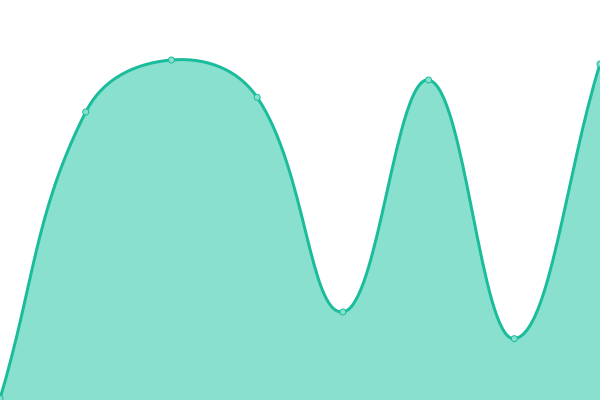

# [📈 Live Status](https://status.bukitasam.co.id): <!--live status--> **🟧 Partial outage**

This repository contains the open-source uptime monitor and status page for [Muhamad Ilham Arrouf](https://ilhamarrouf.my.id), powered by [Upptime](https://github.com/upptime/upptime).

With [Upptime](https://upptime.js.org), you can get your own unlimited and free uptime monitor and status page, powered entirely by a GitHub repository. We use [Issues](https://github.com/ilhamarrouf/uptime-bukitasam/issues) as incident reports, [Actions](https://github.com/ilhamarrouf/uptime-bukitasam/actions) as uptime monitors, and [Pages](https://status.bukitasam.co.id) for the status page.

<!--start: status pages-->
<!-- This summary is generated by Upptime (https://github.com/upptime/upptime) -->
<!-- Do not edit this manually, your changes will be overwritten -->
<!-- prettier-ignore -->
| URL | Status | History | Response Time | Uptime |
| --- | ------ | ------- | ------------- | ------ |
|  [CISEA](https://cisea.bukitasam.co.id) | 🟥 Down | [cisea.yml](https://github.com/ilhamarrouf/uptime-bukitasam/commits/HEAD/history/cisea.yml) | 

 1024ms
     
 | 

<a href="https://status.bukitasam.co.id/history/cisea">0.00%</a>
    

|  [SPEND](https://spend.bukitasam.co.id) | 🟥 Down | [spend.yml](https://github.com/ilhamarrouf/uptime-bukitasam/commits/HEAD/history/spend.yml) | 

 990ms
     
 | 

<a href="https://status.bukitasam.co.id/history/spend">0.00%</a>
    

|  [BATIC](https://batic.cisea.bukitasam.co.id) | 🟩 Up | [batic.yml](https://github.com/ilhamarrouf/uptime-bukitasam/commits/HEAD/history/batic.yml) | 

 1211ms
     
 | 

<a href="https://status.bukitasam.co.id/history/batic">100.00%</a>
    

|  [Sentry](https://sentry.bukitasam.co.id) | 🟥 Down | [sentry.yml](https://github.com/ilhamarrouf/uptime-bukitasam/commits/HEAD/history/sentry.yml) | 

 1548ms
     
 | 

<a href="https://status.bukitasam.co.id/history/sentry">0.00%</a>
    

|  [S3](https://s3.bukitasam.co.id) | 🟩 Up | [s3.yml](https://github.com/ilhamarrouf/uptime-bukitasam/commits/HEAD/history/s3.yml) | 

 951ms
     
 | 

<a href="https://status.bukitasam.co.id/history/s3">100.00%</a>
    

<!--end: status pages-->

[**Visit our status website →**](https://status.bukitasam.co.id)

## 📄 License

- Powered by: [Upptime](https://github.com/upptime/upptime)
- Code: [MIT](./LICENSE) © [Muhamad Ilham Arrouf](https://ilhamarrouf.my.id)
- Data in the `./history` directory: [Open Database License](https://opendatacommons.org/licenses/odbl/1-0/)
